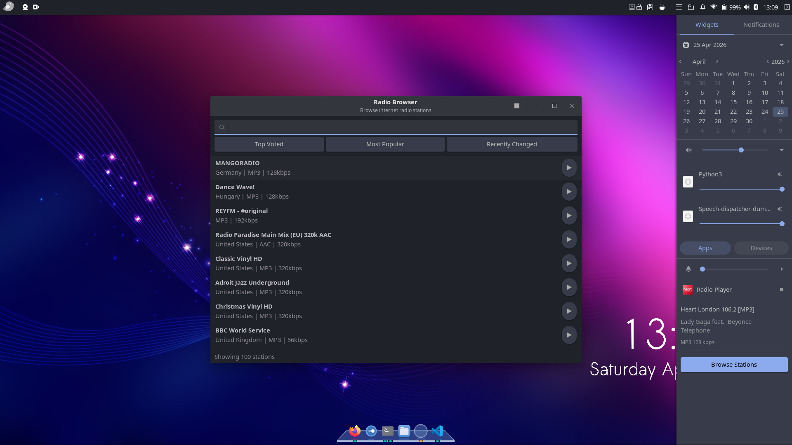

# Budgie Radio Widget

Internet radio player for Budgie Desktop with Raven integration.



## Architecture

The project consists of three components:

1. **Raven Widget** (Vala) - Display playing radio station in Budgie's Raven panel
2. **Radio Daemon** (Python) - D-Bus service managing playback state and stream metadata
3. **GUI Browser** (Python/GTK) - Full-featured application for searching and browsing stations

```
┌─────────────────┐
│  Raven Widget   │ ← Read-only display
│  (Vala/GTK)     │   Shows: Station, Track, Icon
└────────┬────────┘   Button: "Browse Stations"
         │
         │ D-Bus Signals (NowPlaying, PlaybackStopped)
         │
┌────────▼────────┐
│  Radio Daemon   │ ← State manager
│  (Python)       │   • GStreamer playback
└────────┬────────┘   • Radio Browser API (async)
         │            • D-Bus service
         │
         │ D-Bus Methods (PlayStation, StopPlayback)
         │
┌────────▼────────┐
│  GUI Browser    │ ← Full application
│  (Python/GTK)   │   Search, filter, browse stations
└─────────────────┘   Sends play commands to daemon
```

## Features

- **Browse 30,000+ internet radio stations** from radio-browser.info
- **Search** by name, country, genre, language
- **Filter** by popularity, votes, or recent changes
- **Live metadata display** - Shows current track from stream
- **Station icons** - Downloads and displays station logos
- **Minimal Raven widget** - Doesn't block the UI with network operations
- **Independent playback** - Close the browser, music keeps playing
- **5 preset favorites** - Save up to 5 stations for one-click access (like car radio presets)

## Requirements

### System Packages

**Debian/Ubuntu:**
```bash
sudo apt install valac meson ninja-build libgtk-3-dev libglib2.0-dev \
                 libgdk-pixbuf-2.0-dev python3 python3-gi \
                 python3-dbus gir1.2-gstreamer-1.0 gstreamer1.0-plugins-good \
                 gstreamer1.0-plugins-bad gstreamer1.0-plugins-ugly \
                 budgie-core-dev
```

### Python Packages

Or on Ubuntu 26.04+:
```bash
sudo apt install python3-radios
```

## Manual Installation

```
bash
cd budgie-radio-widget
meson setup build --prefix=/usr
meson compile -C build
sudo meson install -C build
```

## Usage

### 1. Restart Budgie Panel

```bash
budgie-panel --replace &
```

### 2. Enable Raven Widget

- Open Budgie Settings → Raven
- Enable "Radio Player" widget
- Open Raven (top-right corner) to see the widget

### 3. Start the Daemon

The daemon should auto-start via D-Bus when needed, but you can start it manually:

```bash
radio-daemon &
```

### 4. Browse Stations

Click "Browse Stations" in the Raven widget, or launch directly:

```bash
budgie-radio-browser
```

## Development

### Project Structure

```
budgie-radio-widget/
├── raven-widget/          # Vala Raven widget
│   ├── RadioWidget.vala   # Main widget code
│   ├── meson.build        # Meson build file
│   └── BudgieRadioWidget.plugin
├── daemon/                # Python daemon
│   ├── radio-daemon.py    # D-Bus service
│   └── org.ubuntubudgie.radio.service
├── gui-app/               # Python GUI browser
│   ├── budgie-radio-browser.py
│   └── budgie-radio-browser.desktop
└── README.md
```

### D-Bus Interface

**Service:** `org.ubuntubudgie.radio.Daemon`  
**Object Path:** `/org/ubuntubudgie/radio/Daemon`  
**Interface:** `org.ubuntubudgie.radio.Daemon`

**Methods:**
- `PlayStation(s: station_uuid)` - Play station by UUID
- `PlayStationDirect(s: name, s: url, s: favicon, s: codec, i: bitrate, s: country)` - Play with direct parameters
- `StopPlayback()` - Stop playback
- `GetCurrentStation() → s` - Get current station name
- `GetCurrentStationUUID() → s` - Get current station UUID
- `GetStationInfo(s: station_uuid) → a{sv}` - Get station details without playing (returns dict with name, url, favicon, codec, bitrate, country)
- `GetLastStation() → a{sv}` - Get last played station details from GSettings

**Signals:**
- `NowPlaying(s: station_name, s: track_info, s: icon_url, s: codec, i: bitrate)` - Emitted on station/track change
- `PlaybackStopped()` - Emitted when playback stops

## Credits

- Radio station data from [radio-browser.info](https://radio-browser.info)
- Uses [python-radios](https://github.com/frenck/python-radios) library
- Built for [Budgie Desktop](https://buddiesofbudgie.org)

## License

GPL-3+ License - see LICENSE file for details

## Contributing

Contributions welcome! Please:

1. Fork the repository
2. Create a feature branch
3. Make your changes
4. Test thoroughly
5. Submit a pull request

## Support

For issues, questions, or suggestions, please open an issue on GitHub.
